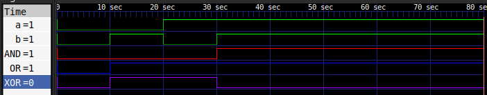
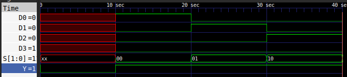
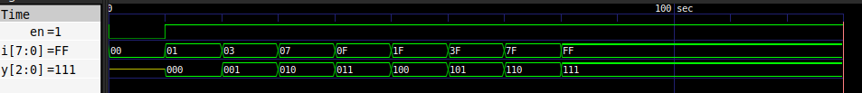
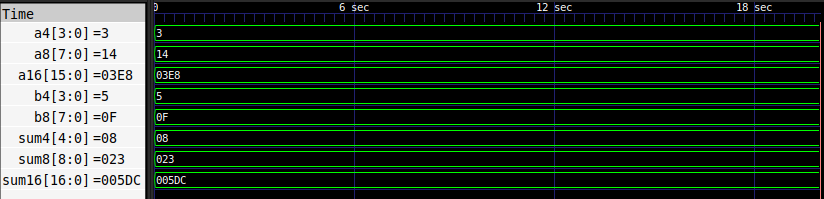

# Day 1 — Tool Verification + SV data types + first simulations

**Phase:** SV Foundations | **Date:** 03/06/2026 | **Hours spent:** 8 hrs

---

## What I studied today

### Morning
- **Verify and install all tools** : Verified all the tools installations and working and explored the software interfaces.
- **SV intro** : SystemVerilog
an extension of verilog designed to improve the verification of DUT(Design Under Test) or DUV(Design under Verification)
- **Data Types** : SV data types like reg(register-stores value), Wire(To make connections), logic (can be both reg or  wire,can be procedural or continuous assignment),Packed Arrays(Single bit data type arrays,contiguous),unpacked arrays(can be of any data type,may or may not be contiguous).
- **X and Z in simulation** - X means not sure or a dont' care as we study in digital logic, in simulation when its not defined what the output is, it is assigned as X or when there is a conflict of values in a connection(making it both 0 and 1).
Z means high impedence or a floating point if any input is left open or unconnected then it is assigned as Z (and the respective floating point value is given to it).
- **HDLbits** - Solved five basics section problem to understand the data types and wire connections.

### Afternoon
- Coded AND,OR,XOR,4:1 MUX , 8:1 priority encoder and parameterized N-bit adder in system verilog and wrote their testbenches to verify the functionalities.
- A common problem that i encountered was figuring out the data types while designing and while writing the testbenches.

### Evening
- **W&H Chapter 1, pp. 1–30**: I learned about the levels of abstraction what is the history of the chips how we got from a few transistors in a big area to billions of transistor in a smaller area and what and how the transistor works at the micro level.
- **NANDLAND.com** - I read the introduction section of FPGAS (Field Programmable Gate Arrays),what are they,why are they used and how are they used, I explored these questions. 

---

## What I built

- **AND** - This block is the design of AND operation between two single bit input binary digits.
- **OR** - This block is the design of OR operation between two single bit input binary digits.
- **XOR** - This block is the design of XOR operation between two single bit input binary digits.
- **MUX** - This block employs a multiplexor that is used to select data from multiple input data lines.
- **Priority Encoder** - This block is an encoder with high to low priority used to encode large data input to small.
- **Parameterized Adder** - This block is just an adder that accepts bit size as an input parameter and outputs the sum of two numbers provided.
---

## Key concepts I now understand

- **[Digital Logic]:** - With my previous knowledge of digital logic and circuits i now completely understand how to implement them in the system verilog code i just need the behaviour of the design that i am implementing.

---

## Code highlights

```verilog
module adder #(parameter N = 8)
(
    input [N-1:0] a,
    input [N-1:0] b,
    output [N:0] sum
);

    assign  sum = a + b;
    
endmodule
```

---

## Simulation result / synthesis result

### Basic Gates


### Multiplexor


### Priority Encoder


### Parameterized Adder


---

## W&H Reading Summary

**Chapter X — [Chapter title], pp. Y–Z**

[3–5 sentences: what was the main idea, what surprised you, 
how does it connect to the RTL/FPGA work you're doing]

---

## Tomorrow's plan

- [ ] [Task 1 for Day N+1]
- [ ] [Task 2]
- [ ] [Task 3]

---

## Resources used today

| Nandland FPGA-101 | SV data types reference |
| HDLBits | Solved 8 problems in Basics section |
| W&H Ch.1 pp.1–30 | VLSI design hierarchy |