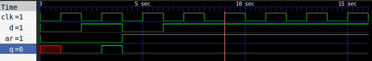
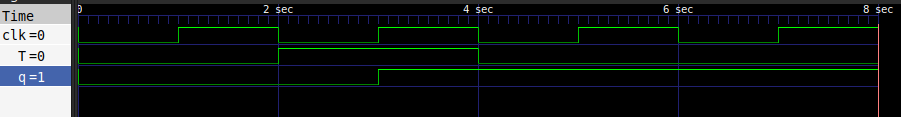
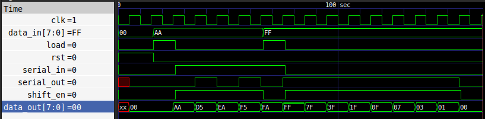
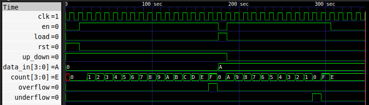
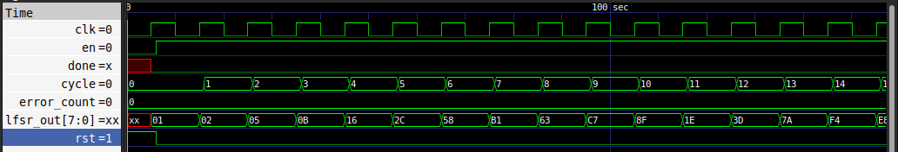
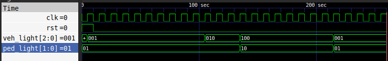

# Day 2 — Always Blocks - the most critical SV Concept 

**Phase:** SV Foundations | **Date:** 04/06/2026 | **Hours spent:** 8 hrs

---

## What I studied today

### Morning
- **asic-world.com** : Read about the SV procedural blocks - always_comb,always_ff,always_latch.
- **Examples on paper** : trace few examples to understand the different usecases of blocking and non-blocking assignments in the system verilog.
- **HDLbits** - Solved complete Latches and flip flops section problems to understand the sequential logic designing

### Afternoon
- Coded D_FF,T_FF,Shift_Register,Up/Down Counter, LFSR and Traffic Light Controller in system verilog and wrote their testbenches to verify the functionalities.
- A common problem that i encountered was figuring out the FSM state transition as one can get confused with states and outputs while designing FSMs.

### Evening
- **W&H Chapter 1, pp. 30–60**: I learned about the levels of abstraction what is the history of the chips how we got from a few transistors in a big area to billions of transistor in a smaller area and what and how the transistor works at the micro level.
- **NANDLAND.com** - I read the introduction section of FPGAS (Field Programmable Gate Arrays),what are they,why are they used and how are they used, I explored these questions. 

---

## What I built

- **D_FF** - This block is the design of AND operation between two single bit input binary digits.
- **OR** - This block is the design of OR operation between two single bit input binary digits.
- **XOR** - This block is the design of XOR operation between two single bit input binary digits.
- **MUX** - This block employs a multiplexor that is used to select data from multiple input data lines.
- **Priority Encoder** - This block is an encoder with high to low priority used to encode large data input to small.
- **Parameterized Adder** - This block is just an adder that accepts bit size as an input parameter and outputs the sum of two numbers provided.
---

## Key concepts I now understand

- **[Digital Logic]:** - With my previous knowledge of digital logic and circuits i now completely understand how to implement them in the system verilog code i just need the behaviour of the design that i am implementing.

---

## Code highlights

```verilog
module adder #(parameter N = 8)
(
    input [N-1:0] a,
    input [N-1:0] b,
    output [N:0] sum
);

    assign  sum = a + b;
    
endmodule
```

---

## Simulation result / synthesis result

### D - Flip Flop


### T - Flip Flop


### 8-bit Shift Register 


### 4-bit synchronous up/down counter


### 8-bit Linear Feedback Shift Register


### Traffic Light Controller


---

## W&H Reading Summary

**Chapter X — [Chapter title], pp. Y–Z**

[3–5 sentences: what was the main idea, what surprised you, 
how does it connect to the RTL/FPGA work you're doing]

---

## Tomorrow's plan

- [ ] [Task 1 for Day N+1]
- [ ] [Task 2]
- [ ] [Task 3]

---

## Resources used today

| Nandland FPGA-101 | SV data types reference |
| HDLBits | Solved 8 problems in Basics section |
| W&H Ch.1 pp.1–30 | VLSI design hierarchy |